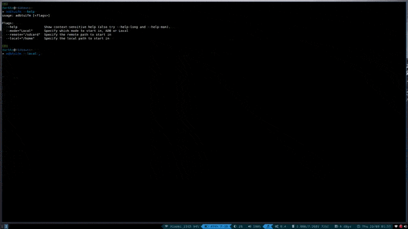

[](https://goreportcard.com/report/github.com/darkhz/adbtuifm)
# adbtuifm



adbtuifm is a TUI-based file manager for the Android Debug Bridge, to make transfers
between the device and client easier.

It has been tested only on Linux. Windows/Mac is currently not supported.

This is a work in progress.

# Features
- Multiselection support, with a selections editor

- Transferring files/folders between the device and the local machine

- Open files of any file type from the device or local machine

- Copy, move, and delete operations on the device and the local machine<br />separately

- View file operations separately on a different screen, with ability to monitor<br />progress and  cancel operation

- Execute commands on the device or local machine, with toggleable<br />foreground/background execution modes

- Filter entries in each directory

- Rename files/folders or create directories

- Switch between adbtuifm and shell easily

- Change to any directory via an inputbox, with autocompletion support

# Installation
```
go get -u github.com/darkhz/adbtuifm
```
# Usage
```
adbtuifm [<flags>]

Flags:
  --mode <Local/ADB>  Specify which mode to start in
  --remote=<path>     Specify the remote(ADB) path to start in
  --local=<path>      Specify the local path to start in
  ```

# Keybindings

## Main Page
|Operation                                 |Key                                 |
|------------------------------------------|------------------------------------|
|Switch between panes                      |<kbd>Tab</kbd>                      |
|Navigate between entries                  |<kbd>Up</kbd>/<kbd>Down</kbd>       |
|Change directory to highlighted entry     |<kbd>Enter</kbd>/<kbd>Right</kbd>   |
|Change one directory back                 |<kbd>Backspace</kbd>/<kbd>Left</kbd>|
|Switch to operations page                 |<kbd>o</kbd>                        |
|Switch between ADB/Local (in each pane)   |<kbd>s</kbd>/<kbd><</kbd>           |
|Change to any directory                   |<kbd>g</kbd>/<kbd>></kbd>           |
|Toggle hidden files                       |<kbd>h</kbd>/<kbd>.</kbd>           |
|Execute command                           |<kbd>!</kbd>                        |
|Refresh                                   |<kbd>r</kbd>                        |
|Move                                      |<kbd>m</kbd>                        |
|Put/Paste (duplicate existing entry)      |<kbd>p</kbd>                        |
|Put/Paste (don't duplicate existing entry)|<kbd>P</kbd>                        |
|Delete                                    |<kbd>d</kbd>                        |
|Open files                                |<kbd>Ctrl</kbd>+<kbd>o</kbd>        |
|Filter entries                            |<kbd>/</kbd>                        |
|Clear filtered entries                    |<kbd>Ctrl</kbd>+<kbd>r</kbd>        |
|Select one item                           |<kbd>Space</kbd>                    |
|Inverse selection                         |<kbd>a</kbd>                        |
|Select all items                          |<kbd>A</kbd>                        |
|Edit selection list                       |<kbd>S</kbd>                        |
|Make directory                            |<kbd>M</kbd>                        |
|Toggle top-down/right-left layout         |<kbd>[</kbd>                        |
|Swap panes                                |<kbd>]</kbd>                        |
|Rename files/folders                      |<kbd>R</kbd>                        |
|Reset selections                          |<kbd>Esc</kbd>                      |
|Temporarily exit to shell                 |<kbd>Ctrl</kbd>+<kbd>d</kbd>        |
|Help                                      |<kbd>?</kbd>                        |
|Quit                                      |<kbd>q</kbd>                        |

## Operations Page
|Operation                |Key                          |
|-------------------------|-----------------------------|
|Navigate between entries |<kbd>Up</kbd>/<kbd>Down</kbd>|
|Cancel selected operation|<kbd>x</kbd>                 |
|Cancel all operations    |<kbd>X</kbd>                 |
|Switch to main page      |<kbd>o</kbd>/<kbd>Esc</kbd>  |

## Change Directory Selector
|Operation                            |Key                          |
|-------------------------------------|-----------------------------|
|Navigate between entries             |<kbd>Up</kbd>/<kbd>Down</kbd>|
|Autocomplete                         |<kbd>Tab</kbd>               |
|Change directory to highlighted entry|<kbd>Enter</kbd>             |
|Move back a directory                |<kbd>Ctrl</kbd>+<kbd>w</kbd> |
|Switch to main page                  |<kbd>Esc</kbd>               |

## Selections Editor
|Operation          |Key                            |
|-------------------|-------------------------------|
|Select one item    |<kbd>Alt</kbd>+<kbd>Space</kbd>|
|Inverse selection  |<kbd>Alt</kbd>+<kbd>a</kbd>    |
|Select all items   |<kbd>Alt</kbd>+<kbd>A</kbd>    |
|Save edited list   |<kbd>Ctrl</kbd>+<kbd>s</kbd>   |
|Cancel editing list|<kbd>Esc</kbd>                 |

## Execution mode
|Operation                                     |Key                         |
|----------------------------------------------|----------------------------|
|Switch between Local/Adb execution            |<kbd>Ctrl</kbd>+<kbd>a</kbd>|
|Switch between Foreground/Background execution|<kbd>Ctrl</kbd>+<kbd>q</kbd>|

# Notes
- As of v0.5.1, keybindings have been revised and the UI has been revamped.<br />

- More information about an entry will be shown only in the **top-down** layout.<br />

- **Only Copy operations are cancellable**. Move and Delete operations will persist.<br />

- The current method to open files is via **xdg-open**. In certain cases, after opening<br /> and modifying a file, the application may take time to exit, and as a result no operations<br /> can be performed on the currently edited file until the application exits. For example, after<br /> opening a zip file via file-roller, modifying it and closing the file-roller GUI, file-roller takes some<br /> time to fully exit, and since the UI is waiting for file-roller to exit, the user cannot perform operations<br /> on the currently modified file until file-roller exits.

# Bugs
-  In directories with a huge amount of entries, autocompletion will lag.
   This happens only on the device side (i.e ADB mode), where there is
   significant latency in transferring and processing the directory listing
   to the client.
